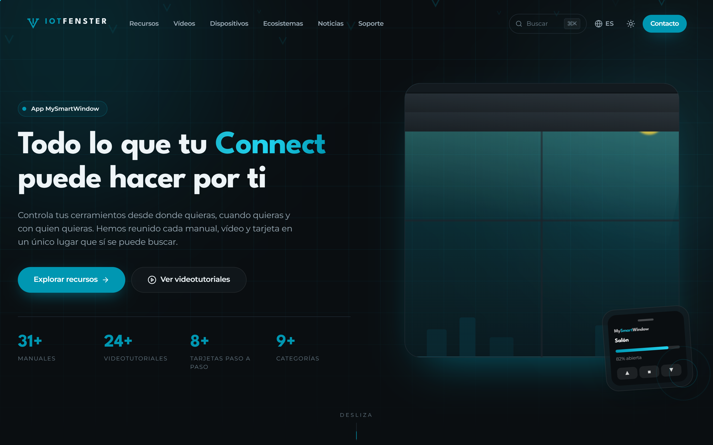
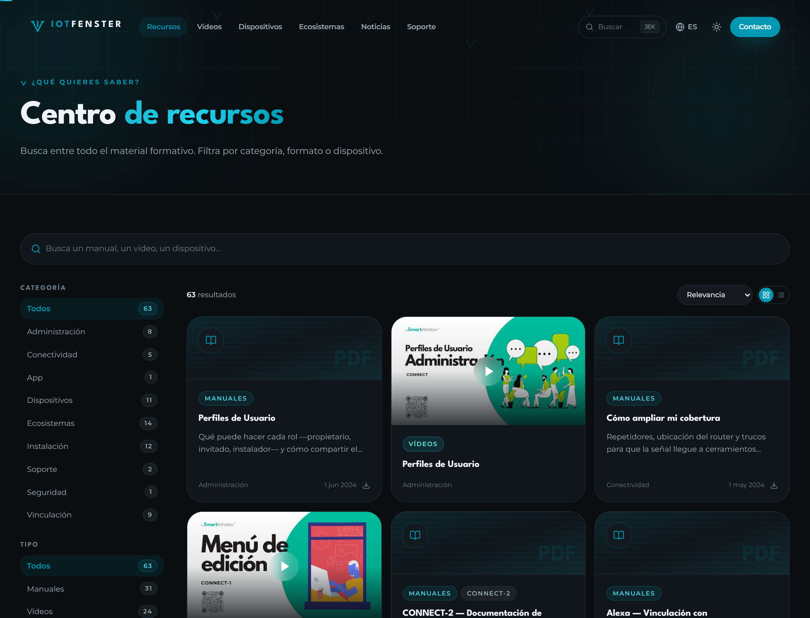
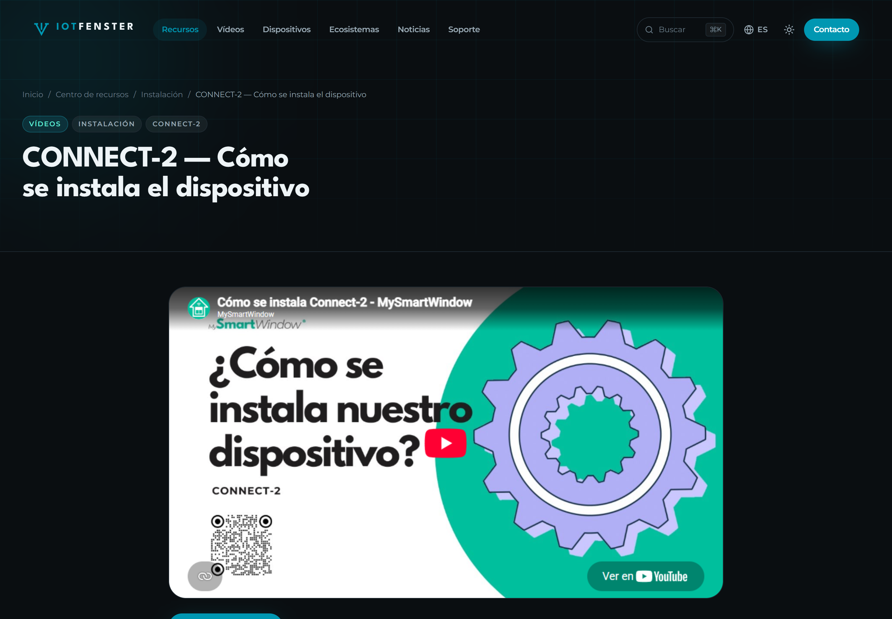
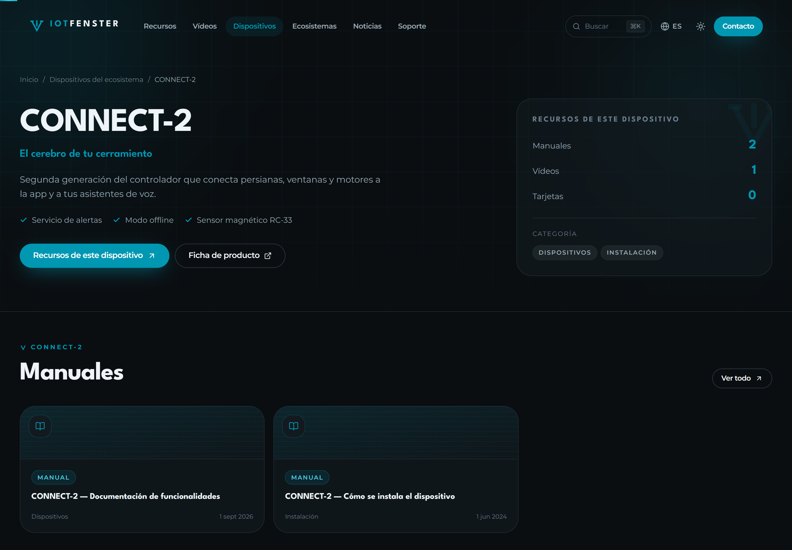
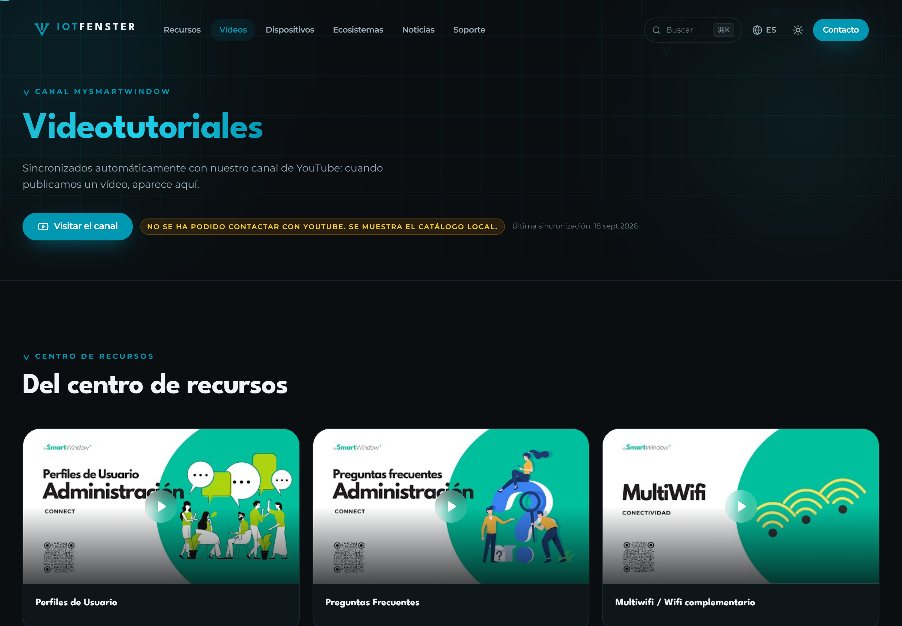
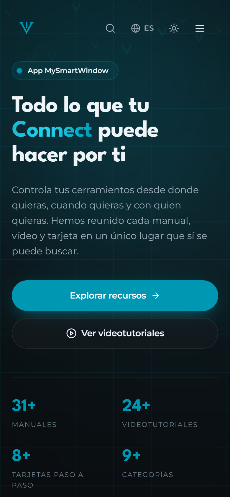
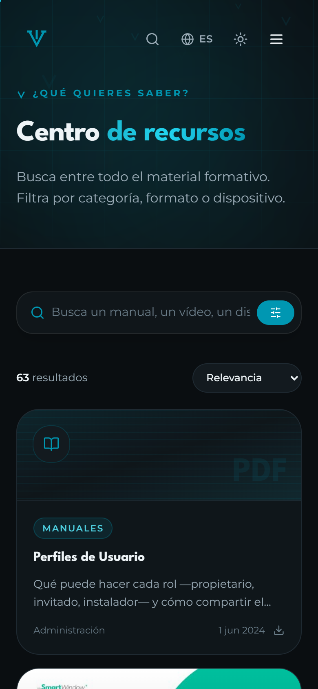

<div align="center">


# MySmartWindow · Centro de recursos

**Reinterpretación del portal de manuales de [IoT Fenster](https://www.iotfenster.com/app-mysmartwindow/): mismo contenido, búsqueda de verdad, y los vídeos sincronizados solos con YouTube.**

[](https://nextjs.org)
[](https://www.typescriptlang.org)
[](https://tailwindcss.com)
[](#internacionalización)
[](#qué-resuelve)

</div>

<br />



<br />

## Qué resuelve

El portal original tiene todo el material formativo detrás de un acordeón: sin buscador, sin enlaces compartibles, y cada manual apuntando directamente a un PDF mientras cada vídeo se va a YouTube. El contenido es bueno; el escaparate, no.

| | Portal original | Este proyecto |
| --- | --- | --- |
| Buscar un manual | No se puede | Búsqueda difusa, sin acentos, con filtros |
| Enlazar a un recurso | Imposible | URL propia por recurso |
| Páginas indexables | 1 | **261** |
| Vídeos | Enlace a youtube.com | Ficha propia + reproductor incrustado |
| Idiomas declarados | ES, EN (falta el IT publicado) | ES · EN · IT con `x-default` |
| Datos estructurados | Genéricos | `VideoObject`, `TechArticle`, `Product`, `FAQPage`, `ItemList` |
| Imágenes con texto alternativo | 3 de 75 | Todas |

> El análisis completo de competencia y la estrategia de posicionamiento están en un documento aparte; este README cubre el proyecto técnico.

<br />

## El centro de recursos



Sustituye al acordeón del portal original:

- **Búsqueda difusa e insensible a acentos** — `instalacion` encuentra *Instalación*
- **Filtros combinables** por categoría, formato y dispositivo, con contadores en vivo
- **URL compartible** — `/es/recursos?cat=vinculacion&tipo=video`
- **Paleta de comandos** con <kbd>⌘</kbd>/<kbd>Ctrl</kbd> + <kbd>K</kbd> desde cualquier página
- Vista cuadrícula o lista, y en móvil los filtros en hoja inferior

Cada tarjeta es un **enlace real** a su ficha, no un botón: se puede abrir en otra pestaña, compartir e indexar. El clic normal abre el modal de vista rápida; el resto de gestos llevan a la página.

<br />

## Ficha por recurso



**63 recursos × 3 idiomas = 189 páginas indexables.** Cada una con migas de pan, su reproductor o visor de PDF, contexto textual de la categoría y el dispositivo, recursos relacionados y su propia imagen para redes sociales generada al vuelo.

Los PDF se sirven por un proxy propio (`/api/pdf`, con lista blanca de hosts) porque incrustar un PDF de otro dominio falla a menudo. En móvil no se incrusta: casi ningún navegador móvil lo muestra, así que se ofrece una ficha con acción directa.

<br />

## Ficha por dispositivo



Los 9 dispositivos del ecosistema, cada uno con su documentación agrupada por formato y marcado `Product` para buscadores.

<br />

## Sincronización con YouTube



Canal [MySmartWindow](https://www.youtube.com/@MySmartWindow). Dos estrategias, y el resto de la aplicación no sabe cuál está activa:

1. **Con `YOUTUBE_API_KEY`** → YouTube Data API v3: catálogo completo, duraciones, visualizaciones y las listas de reproducción reales.
2. **Sin clave** → feed RSS público del canal. No requiere configuración. **Es lo que está activo por defecto.**

El catálogo curado manda en **título traducido, categoría y dispositivo** —eso es trabajo editorial—; YouTube aporta **miniatura, duración, visitas y fecha** en vivo. Cualquier vídeo nuevo del canal que aún no esté categorizado aparece solo en «Últimos vídeos del canal».

> **Publicas en YouTube y sale en la web sin tocar código.**

Revalidación cada hora. Para forzar una resincronización: `curl -X POST http://localhost:3000/api/youtube`

<br />

## Responsive

<div align="center">

&nbsp;&nbsp;

</div>

<br />

Diseñado desde 320 px. Decisiones concretas:

- Punto de ruptura extra `xs` (416 px) para móviles estrechos
- En móvil el logotipo se reduce al isotipo, para que quepa el menú
- Filtros en hoja inferior con chips, en lugar de barra lateral
- Carriles de vídeo con desplazamiento horizontal y *scroll snap*
- Inclinación 3D sólo en escritorio: en táctil no aporta y cuesta rendimiento

<br />

## El sistema de diseño sale del logo

El isotipo de IOT FENSTER es una **V descendente con barra central y remates superiores**: una flecha que baja, igual que una persiana. Todo el lenguaje visual parte de ahí.

| Elemento | Dónde |
| --- | --- |
| Cian corporativo `#0097B2` | `--color-brand-500` en `src/app/globals.css` |
| Isotipo en SVG animable | `src/components/brand/Logo.tsx` |
| Lluvia de chevrons | `ChevronRain` en `src/components/ui/motion.tsx` |
| Lamas de persiana | utilidad `.slats` |
| Rejilla técnica | utilidad `.grid-tech` |
| Anillos de señal | animación `pulse-ring` |
| Persiana que se abre | `WindowMockup` en `src/components/sections/Hero.tsx` |

Tipografías **League Spartan** (títulos) y **Montserrat** (texto), las mismas del sitio original. Modo claro y oscuro. Toda animación respeta `prefers-reduced-motion`.

<br />

## Arrancar

```bash
npm install
npm run dev
```

Abre <http://localhost:3000> — el middleware te redirige a tu idioma.

```bash
npm run build      # compilación de producción
npm run start      # servir la compilación
npm run typecheck  # TypeScript sin emitir
node scripts/screenshots.mjs   # regenerar las capturas de este README
```

<br />

## Estructura

```
src/
├─ app/
│  ├─ [locale]/                    # todas las páginas, por idioma
│  │  ├─ page.tsx                          # portada
│  │  ├─ recursos/[id]/                    # 189 fichas de recurso
│  │  ├─ dispositivos/[id]/                # 27 fichas de dispositivo
│  │  ├─ videos/ · ecosistemas/ · soporte/
│  │  ├─ noticias/[slug]/                  # blog (listo para Strapi)
│  │  ├─ contacto/
│  │  ├─ opengraph-image.tsx               # imagen social generada
│  │  └─ template.tsx                      # transición entre páginas
│  ├─ api/
│  │  ├─ youtube/    # estado de sincronización + revalidación
│  │  ├─ pdf/        # proxy con lista blanca de hosts
│  │  ├─ contacto/ · newsletter/
│  ├─ sitemap.ts · robots.ts
│  └─ globals.css    # design tokens y utilidades de marca
├─ components/       # brand · layout · ui · sections · resources · videos
├─ data/             # catálogo, taxonomía, noticias, FAQ, ecosistemas
├─ i18n/             # diccionarios ES · EN · IT
├─ lib/              # youtube, seo, proyecciones, navegación
└─ middleware.ts     # detección y redirección de idioma
```

<br />

## Internacionalización

Tres idiomas completos con el mismo slug de ruta, así los enlaces son estables. El middleware detecta el idioma por `Accept-Language` y redirige.

El `hreflang` declara los tres más `x-default` — el portal original se deja fuera el italiano pese a publicarlo, que es un fallo real de posicionamiento.

<br />

## El catálogo

`src/data/resources.ts` contiene **63 recursos reales** extraídos del portal público, en las 9 categorías originales y etiquetados por dispositivo:

| Categoría | Manuales | Vídeos | Tarjetas |
| --- | --: | --: | --: |
| Administración | 2 | 2 | 4 |
| Conectividad | 4 | 1 | – |
| App | – | 1 | – |
| Dispositivos | 8 | 2 | 1 |
| Ecosistemas | 7 | 7 | – |
| Instalación | 7 | 5 | – |
| Soporte | – | 2 | – |
| Seguridad | – | 1 | – |
| Vinculación | 3 | 3 | 3 |

Dos correcciones respecto al original:

- El enlace «Crea una red Wi-Fi – Movistar/O2» está **roto** en el portal actual. Aquí se marca como no disponible en vez de llevar a un error.
- Cinco manuales se llamaban todos «Documentación de funcionalidades» sin decir de qué dispositivo. Ahora lo llevan delante.

<br />

## Despliegue

Ver **[DEPLOY.md](DEPLOY.md)** para la guía completa: Docker, Linux + nginx y Windows Server + IIS.

Lo esencial: **no es un sitio estático**, necesita Node en ejecución. El build genera una salida autocontenida (`output: 'standalone'`) de unos 100 MB con su propio `server.js`.

> ⚠️ Las variables `NEXT_PUBLIC_*` **se incrustan al compilar**. Si se compila sin `NEXT_PUBLIC_SITE_URL`, el sitemap y las URLs canónicas apuntan a `localhost` y el SEO no funciona. Cambiar el dominio obliga a recompilar.

<br />

## Estado

**Hecho:** portada, centro de recursos, fichas de recurso y dispositivo, vídeos sincronizados, ecosistemas, noticias, soporte, contacto, los tres idiomas, datos estructurados, sitemap, imágenes sociales, modo claro/oscuro, responsive.

**Pendiente:**

- [ ] Decidir dominio y desplegar con `NEXT_PUBLIC_SITE_URL` real
- [ ] Conectar un proveedor de correo: el formulario valida y responde, pero **no envía nada**
- [ ] Clave de la API de YouTube para las listas de reproducción reales
- [ ] Validar el marcado en el test de resultados enriquecidos (necesita URL pública)
- [ ] Medir rendimiento con Lighthouse
- [ ] **Strapi**, para que soporte publique sin depender de desarrollo — los tipos de `src/data/` ya son el contrato

<br />

---

<div align="center">
<sub>Construido a partir del portal público de IoT Fenster. Los PDF y vídeos enlazan a los originales alojados por IoT Fenster.</sub>
</div>
