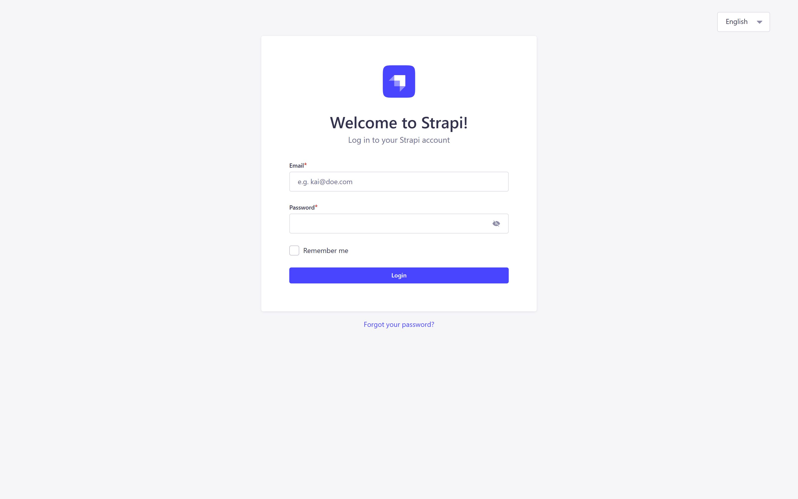
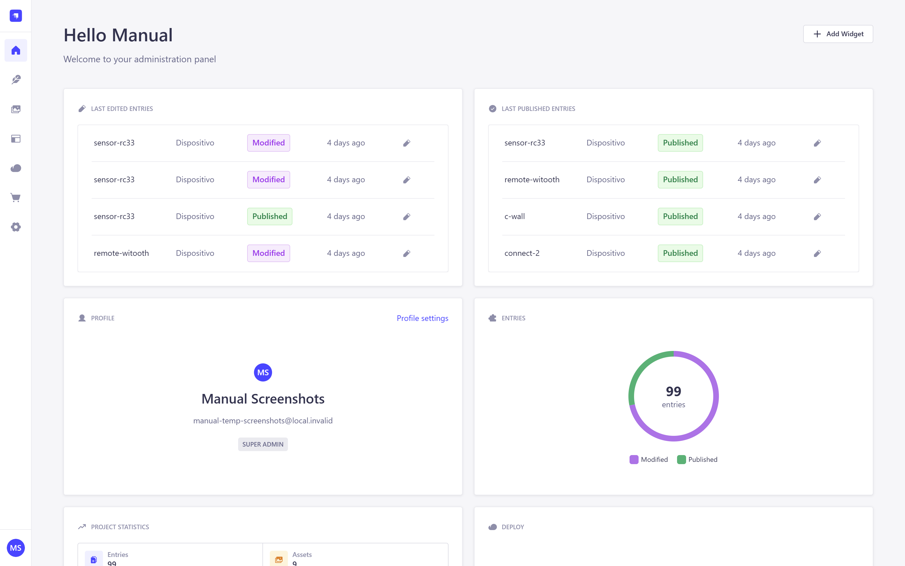
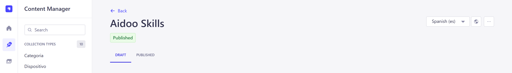
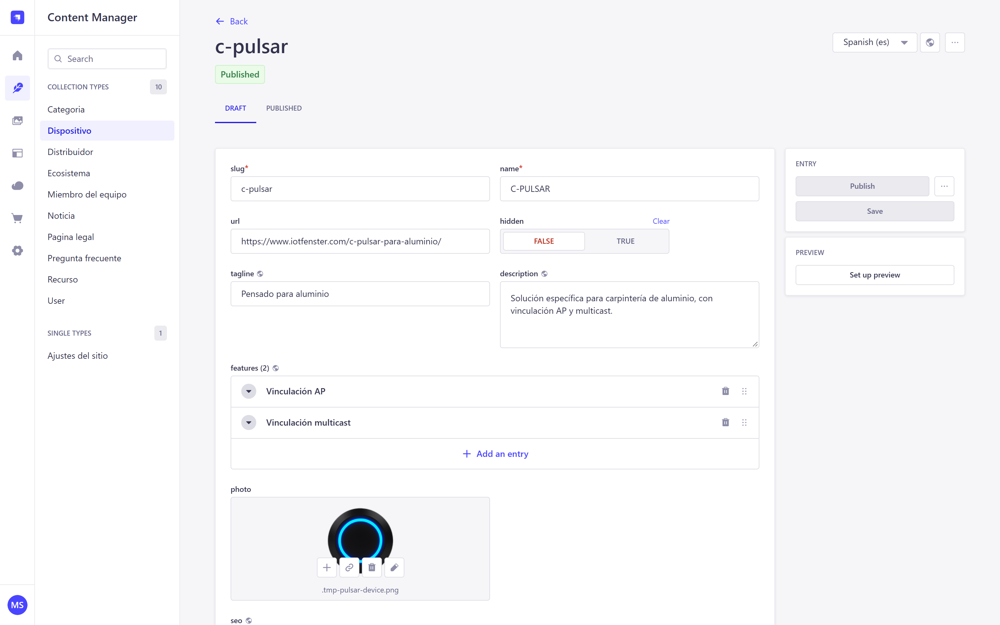
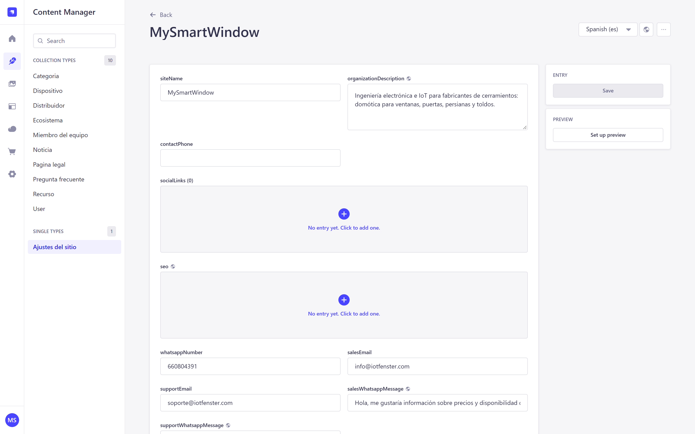

# Manual del panel de contenidos (Strapi) — MySmartWindow

Guía paso a paso para quien va a subir o actualizar contenido de
`mysmartwindow.com` (manuales, vídeos, dispositivos, noticias...) usando el
panel de administración, sin tocar código.

> Si buscas solo la referencia rápida de campos por tipo de contenido, existe
> una versión más corta en [`GUIA-DE-CONTENIDOS.md`](../GUIA-DE-CONTENIDOS.md).
> Este documento es el mismo contenido pero explicado paso a paso, con
> capturas de pantalla y una "receta" para cada tarea habitual.

## Índice

1. [Entrar al panel](#1-entrar-al-panel)
2. [El panel, de un vistazo](#2-el-panel-de-un-vistazo)
3. [Cinco ideas que hay que entender antes de tocar nada](#3-cinco-ideas-que-hay-que-entender-antes-de-tocar-nada)
4. [Recetas paso a paso](#4-recetas-paso-a-paso)
   - [4.1 Subir un manual en PDF nuevo](#41-subir-un-manual-en-pdf-nuevo)
   - [4.2 Añadir un vídeo de YouTube al catálogo](#42-añadir-un-vídeo-de-youtube-al-catálogo)
   - [4.3 Añadir una tarjeta informativa](#43-añadir-una-tarjeta-informativa)
   - [4.4 Traducir un recurso a los tres idiomas](#44-traducir-un-recurso-a-los-tres-idiomas)
   - [4.5 Editar la ficha de un dispositivo](#45-editar-la-ficha-de-un-dispositivo)
   - [4.6 Publicar una noticia](#46-publicar-una-noticia)
   - [4.7 Añadir una pregunta frecuente](#47-añadir-una-pregunta-frecuente)
   - [4.8 Editar una página legal](#48-editar-una-página-legal)
   - [4.9 Añadir o editar un distribuidor](#49-añadir-o-editar-un-distribuidor)
   - [4.10 Añadir o editar un miembro del equipo](#410-añadir-o-editar-un-miembro-del-equipo)
   - [4.11 Cambiar el email o el WhatsApp de contacto](#411-cambiar-el-email-o-el-whatsapp-de-contacto)
5. [Referencia completa por tipo de contenido](#5-referencia-completa-por-tipo-de-contenido)
6. [Cuánto tarda en verse un cambio en la web](#6-cuánto-tarda-en-verse-un-cambio-en-la-web)
7. [Cosas que no se deben tocar](#7-cosas-que-no-se-deben-tocar)
8. [Solución de problemas frecuentes](#8-solución-de-problemas-frecuentes)
9. [Anexo técnico: qué se podría mejorar en el panel](#9-anexo-técnico-qué-se-podría-mejorar-en-el-panel)

---

## 1. Entrar al panel

La dirección es:

- **En producción**: `https://cms.iotfenster.com/admin` (o el subdominio que
  corresponda; ver la nota de migración de dominio más abajo).
- **En local** (si alguien está probando algo en su propio ordenador):
  `http://localhost:1337/admin`

Con el correo y la contraseña que te haya dado quien mantiene el sitio.

Al entrar ves la pantalla de inicio, con un resumen de lo último que se ha
editado y publicado:

No hace falta usar esta pantalla de inicio para nada — es solo un resumen.
Todo el trabajo de editar contenido pasa por **Content Manager**, el icono de
la pluma en el menú de la izquierda.

---

## 2. El panel, de un vistazo

En el menú de la izquierda (de arriba abajo):

| Icono | Sección | Para qué sirve |
| --- | --- | --- |
| Casa | Inicio | El resumen que has visto al entrar. Informativo, nada más. |
| Pluma | **Content Manager** | Aquí se edita **todo** el contenido. El 95% del trabajo pasa por aquí. |
| Imagen | **Media Library** | La biblioteca de imágenes, PDF y vídeos subidos. |
| Otros iconos (paneles, nube, carrito...) | Plugins / Marketplace | No se tocan — ver [sección 7](#7-cosas-que-no-se-deben-tocar). |
| Engranaje | Settings | Idiomas, usuarios, tokens... también de la sección 7. |

Dentro de **Content Manager**, la columna de la izquierda lista un elemento
por cada tipo de contenido. Así se ve con el catálogo real del sitio (fíjate
en que cada nombre está en español, aunque el contenido se traduzca a los
tres idiomas):

Fíjate en dos cosas de esta pantalla, porque se repiten en todos los tipos de
contenido:

- **Arriba a la derecha**, el selector de idioma (aquí "Spanish (es)"): decide
  qué idioma estás viendo en el listado. Esto no cambia el contenido, solo el
  filtro de qué se muestra.
- **Columna "Status"**: en verde, "Published" — el contenido ya está visible
  en la web. Si pusiera "Draft" (en gris), sería un borrador que nadie más ve
  todavía.

Para abrir una ficha y editarla, **haz clic sobre su título** en la lista (no
sobre el ID).

---

## 3. Cinco ideas que hay que entender antes de tocar nada

### a) Colecciones vs. ficha única

Casi todo lo que ves en la barra lateral es una **colección**: una lista con
muchas fichas (63 recursos, 9 dispositivos...). Hay una única excepción:
**Ajustes del sitio**, que no es una lista — es una ficha sola con los datos
globales de la web (contacto, WhatsApp, textos por defecto).

### b) El `slug`

Casi todas las fichas tienen un campo `slug` al principio. Es el
identificador que forma parte de la URL pública de esa página (por ejemplo,
`connect-2` en `mysmartwindow.com/es/dispositivos/connect-2`).

**No se cambia nunca.** Si lo cambias, la URL antigua deja de funcionar — y
si alguien tenía ese enlace guardado, compartido o indexado en Google, se
encuentra con una página rota.

### c) Borrador vs. publicado

Cada ficha tiene dos botones: **Save** (guarda como borrador — solo tú lo
ves) y **Publish** (lo saca a la web). Dos matices importantes:

- Si editas algo que **ya estaba publicado**, tienes que volver a pulsar
  **Publish** para que el cambio llegue a la web. Guardar (`Save`) por sí solo
  no actualiza lo que ya está publicado.
- Si nunca despublicas ni borras una ficha, lo peor que puede pasar al
  equivocarte es que el cambio no llegue a la web todavía — no que se rompa
  algo que ya funcionaba.

### d) Cada idioma es una copia independiente

Arriba a la derecha de cada ficha hay un selector de idioma (ES / EN / IT):

**Escribir en español no traduce el inglés ni el italiano.** Son tres copias
de los campos traducibles, cada una con su propio texto. Si cambias algo en
español y quieres que se refleje también en las otras dos versiones, tienes
que entrar en cada idioma (con este mismo selector) y escribirlo tú.

Los campos que **no** son traducibles (identificadores, relaciones,
booleanos, colores...) sí son automáticamente los mismos en los tres
idiomas — esos los rellenas una sola vez.

### e) El bloque SEO

Varios tipos de contenido traen un bloque `seo` opcional (título para
Google, descripción, palabras clave, imagen para compartir en redes). **Si lo
dejas vacío, no pasa nada malo**: el sitio genera automáticamente un título y
una descripción razonables a partir del propio contenido. Rellénalo solo
cuando quieras algo distinto al automático.

---

## 4. Recetas paso a paso

### 4.1 Subir un manual en PDF nuevo

1. **Content Manager → Recurso → Create new entry.**
2. Rellena, en este orden:
   - `slug`: un identificador corto en minúsculas y con guiones (p. ej.
     `connect-3-instalacion-manual`). No lleva espacios ni tildes.
   - `type`: `manual`.
   - `category`: la categoría a la que pertenece (relación — empieza a
     escribir y elige de la lista).
   - `device`: el dispositivo al que pertenece, o `general` si aplica a
     todos.
   - `title`: el título que se va a ver en la web.
   - `summary`: el resumen corto que aparece bajo el título (opcional).
3. En el campo **`file`** (el primero de la ficha, un recuadro con botón de
   subida): haz clic, **Añadir activos**, elige el PDF de tu ordenador, y
   confirma. No hace falta pasar por la Media Library ni copiar ninguna URL —
   es un único paso.
4. Deja `url` vacío (ese campo es solo para cuando el PDF ya vive en otra
   web y quieres enlazarlo sin subir copia).
5. **Save**, y luego **Publish**.
6. Repite el paso 2 (solo `title` y `summary`) en inglés e italiano, con el
   selector de idioma de la cabecera — el resto de campos (categoría,
   dispositivo, el PDF subido...) ya están compartidos en los tres idiomas.

### 4.2 Añadir un vídeo de YouTube al catálogo

Antes de nada: si el vídeo ya está en el canal de YouTube de la empresa, en
la página `/videos` aparece solo, sin hacer nada — eso es automático. Esta
receta es para cuando además quieres que el vídeo tenga **su propia ficha**
en el catálogo de recursos, con categoría y dispositivo asignados.

1. Copia el ID del vídeo: en
   `https://www.youtube.com/watch?v=tZ1aSM4zxdI`, el ID es lo que va después
   de `v=` — aquí, `tZ1aSM4zxdI`.
2. **Content Manager → Recurso → Create new entry.**
3. `slug` (identificador interno), `type: video`, `category`, `device`,
   `title`, `summary`.
4. Pega el ID en `youtubeId`. Si el vídeo pertenece a una lista de
   reproducción del canal, puedes rellenar también `playlistId` con el ID de
   esa lista (opcional).
5. **Save → Publish.**

La miniatura, la duración y las visitas se sincronizan solas con YouTube; no
hay que rellenarlas a mano.

### 4.3 Añadir una tarjeta informativa

Igual que el manual PDF (receta 4.1), pero con `type: tarjeta` y sin
rellenar `file` ni `url` — las tarjetas no enlazan a un documento, son solo
título y resumen.

### 4.4 Traducir un recurso a los tres idiomas

1. Abre la ficha del recurso (en el idioma que ya esté escrito, normalmente
   español).
2. Cambia el selector de idioma de la cabecera a **English (en)**.
3. Verás los mismos campos, vacíos en esta copia. Rellena `title` y
   `summary` en inglés.
4. **Save → Publish** (en este idioma también hay que publicar; no basta con
   haberlo publicado en español).
5. Repite para **Italiano (it)**.

Esta misma mecánica — cambiar el selector, rellenar, guardar, publicar, para
cada idioma — es igual en cualquier tipo de contenido, no solo en recursos.

### 4.5 Editar la ficha de un dispositivo

- `tagline` y `description`: texto libre, traducible.
- `features`: la lista de características. Para añadir una línea nueva, pulsa
  **Add an entry**; para quitar una, la papelera junto a la línea. Hazlo
  **en cada idioma** por separado.
- `photo`: la foto de portada — clic sobre el recuadro y sube el archivo tal
  cual sale de la cámara; el sitio la reescala solo.
- `gallery`: más fotos, en el orden en que las subas.
- `videos`: vídeos propios del dispositivo (no los del canal de YouTube).
  Sube MP4 de 1080p como mucho, y por debajo de 50 MB si el vídeo dura un par
  de minutos — si pesa mucho más, conviene comprimirlo antes de subirlo.

`photo`, `gallery` y `videos` forman un único carrete en la ficha pública del
dispositivo (portada, luego fotos, luego vídeos, con una tira de
miniaturas). Ni las fotos ni los vídeos se traducen — la misma imagen vale
para los tres idiomas.

### 4.6 Publicar una noticia

**Content Manager → Noticia → Create new entry.**

- `title`, `excerpt` (extracto corto) y `body` (el texto completo):
  traducibles.
- `tag`: la etiqueta que se muestra sobre el título (traducible).
- `postDate`: la fecha que decide el orden de aparición (la más reciente
  primero) — no tiene por qué coincidir con el día que le das a publicar.
- `readingMinutes`: los minutos de lectura estimados que se muestran junto a
  la fecha (por defecto, 3; cámbialo si el texto es mucho más largo o corto).
- `cover`: imagen de portada, opcional — si la dejas vacía, se usa un
  degradado de color en su lugar.
- `featured`: si quieres que aparezca destacada.

### 4.7 Añadir una pregunta frecuente

**Content Manager → Pregunta frecuente → Create new entry.**

- `slug`: identificador interno, sin espacios (no se ve en ningún sitio, pero
  es obligatorio).
- `question` y `answer`: traducibles.
- `resource` (opcional): si la respuesta hace referencia a un manual o vídeo
  concreto, enlázalo aquí — en la web aparecerá un botón "Ver más" bajo la
  respuesta.

### 4.8 Editar una página legal

Solo hay tres: **aviso legal**, **política de privacidad** y **política de
cookies**. Al entrar en **Pagina legal**, edita la que corresponda (no crees
una nueva — ver [sección 7](#7-cosas-que-no-se-deben-tocar)).

- `title` e `intro`: traducibles.
- `body`: el documento completo, traducible, en un Markdown muy sencillo:

  | Escribes | Sale |
  | --- | --- |
  | `## 1. Título del apartado` | Un apartado, que además aparece solo en el índice lateral de la página |
  | `### Subapartado` | Un subtítulo dentro del apartado |
  | `- Una cosa` | Un punto de una lista |
  | `**importante**` | Texto en **negrita** |
  | `[texto](/es/contacto)` | Un enlace a otra página de este sitio |
  | `[texto](https://www.aepd.es)` | Un enlace externo, que se abre en otra pestaña |

  También se pueden hacer tablas (una fila por línea, columnas separadas por
  `|`, con la fila de guiones `---` obligatoria después de la cabecera).
  Cualquier otra cosa — HTML, imágenes, código — se muestra tal cual como
  texto, a propósito: nadie puede colar código en la página que más
  necesita ser de fiar.

  El índice de la izquierda de la página **se genera solo** a partir de los
  `## Apartado` del texto — no hay que escribirlo aparte.

  Al enlazar a otra página legal de este mismo sitio, usa siempre estas
  rutas (cambiando `/es/` por `/en/` o `/it/` según el idioma):
  - `/es/legal/politica-de-privacidad`
  - `/es/legal/aviso-legal`
  - `/es/legal/politica-de-cookies`

  Nunca enlaces al WordPress antiguo (`iotfenster.com/aviso-legal` y
  similares) — esas páginas van a desaparecer.

- `lastUpdated`: **cámbiala siempre** que edites el texto. Es la fecha que ve
  el usuario y la prueba de desde cuándo está publicada esa versión, si algún
  día hay una reclamación.

### 4.9 Añadir o editar un distribuidor

**Content Manager → Distribuidor.**

- `name`, `url` (ficha del distribuidor) y `contactUrl` (enlace de
  contacto): no traducibles.
- `tagline`, `description` y `country`: traducibles.
- `logo`: súbelo aquí mismo, se abre la Media Library.
- `brands` y `accent`: son campos técnicos (qué marcas comercializa, el color
  de acento de su tarjeta) — coordínalo con quien mantiene el sitio si hace
  falta tocarlos, no son de uso diario.

### 4.10 Añadir o editar un miembro del equipo

**Content Manager → Miembro del equipo.**

- `name`: no traducible.
- `role` (el cargo) y `bio` (la biografía corta): traducibles.
- `photo`: foto de la persona.
- `linkedin`: enlace a su perfil, opcional.
- `order`: un número que decide el orden en la página de equipo, de menor a
  mayor (por defecto 100 — para que alguien salga el primero, ponle un
  número más bajo que el resto, por ejemplo 10).

### 4.11 Cambiar el email o el WhatsApp de contacto

**Content Manager → Ajustes del sitio** (es la única ficha de tipo único —
no hay lista, se entra directo a editar).

| Campo | Para qué sirve |
| --- | --- |
| `salesEmail` | El correo de "Consulta comercial" (precios, catálogo, disponibilidad). |
| `supportEmail` | El correo de "Soporte técnico" (incidencias de un dispositivo ya instalado). |
| `whatsappNumber` | El número de WhatsApp Business — solo dígitos con prefijo de país (p. ej. `34600111222`, sin `+` ni espacios). Es el mismo número para comercial y soporte. |
| `salesWhatsappMessage` | El mensaje precargado al pulsar "Consulta comercial" por WhatsApp (traducible). |
| `supportWhatsappMessage` | El mensaje precargado al pulsar "Soporte / incidencias" por WhatsApp (traducible). |

Si `whatsappNumber` se deja vacío, el botón de WhatsApp simplemente no
aparece en la web. No hace falta rellenar `socialLinks` — ver la nota en la
[sección 9](#9-anexo-técnico-qué-se-podría-mejorar-en-el-panel).

---

## 5. Referencia completa por tipo de contenido

| Tipo de contenido | Campos traducibles (ES/EN/IT) | Campos compartidos (se rellenan una vez) |
| --- | --- | --- |
| **Recurso** (`manual`/`video`/`tarjeta`) | `title`, `summary`, `seo` | `slug`, `type`, `category`, `device`, `file`, `url`, `youtubeId`, `playlistId`, `updatedOn`, `broken`, `featured`, `tags` |
| **Dispositivo** | `tagline`, `description`, `features`, `seo` | `slug`, `name`, `url`, `hidden`, `photo`, `gallery`, `videos` |
| **Categoría** | `name`, `description` | `slug`, `icon` |
| **Ecosistema** | `description` | `slug`, `name`, `vendor`, `color`, `match` |
| **Distribuidor** | `tagline`, `description`, `country` | `slug`, `name`, `url`, `contactUrl`, `accent`, `brands`, `logo` |
| **Miembro del equipo** | `role`, `bio` | `slug`, `name`, `order`, `linkedin`, `photo` |
| **Noticia** | `title`, `excerpt`, `body`, `tag`, `seo` | `slug`, `postDate`, `readingMinutes`, `gradient`, `cover`, `featured` |
| **Pregunta frecuente** | `question`, `answer` | `slug`, `resource` |
| **Página legal** | `title`, `intro`, `body`, `seo` | `slug`, `lastUpdated` |
| **Ajustes del sitio** (único) | `organizationDescription`, `salesWhatsappMessage`, `supportWhatsappMessage`, `seo` | `siteName`, `salesEmail`, `supportEmail`, `contactPhone`, `whatsappNumber`, `socialLinks` |

Notas sobre campos que no salen en las recetas de arriba porque casi nunca
hace falta tocarlos:

- **`broken`** (en Recurso): márcalo en `TRUE` si el enlace original del
  manual está roto. En vez de mostrar un enlace que da error, la web muestra
  un aviso de "documento no disponible".
- **`updatedOn`** (en Recurso): la fecha que se muestra como "Actualizado el
  ..." en la ficha pública del recurso.
- **`tags`** (en Recurso): palabras clave extra para el buscador interno del
  centro de recursos — no se ven en la página, solo ayudan a encontrarlo.
- **`hidden`** (en Dispositivo): oculta el dispositivo de los listados
  públicos sin borrarlo — útil para un dispositivo descatalogado del que
  todavía cuelgan manuales.
- **`gradient`** (en Noticia): si no subes `cover`, este campo permite elegir
  a mano el degradado de color de la portada (opcional; si se deja vacío, el
  sitio elige uno).
- **`match`** y **`color`** (en Ecosistema): identifican el ecosistema en el
  código (qué recursos casan con Alexa, Google Home...) y el color de su
  insignia. Son de configuración, no de contenido del día a día.

---

## 6. Cuánto tarda en verse un cambio en la web

Al pulsar **Publish**, el cambio no aparece siempre al instante:

- Con el **webhook de refresco activado** (así está configurado en
  producción), la web se entera en cuanto publicas y el cambio se ve **en
  segundos**.
- Si por lo que sea el webhook no llegara a disparar, la web relee el CMS
  igualmente **una vez por hora** como máximo, así que en el peor de los
  casos el cambio tarda hasta esa hora en aparecer solo.

Si un cambio no aparece pasados unos minutos y es urgente, dilo a quien
mantiene el sitio para comprobar el webhook — no hace falta que tú hagas nada
más desde el panel.

---

## 7. Cosas que no se deben tocar

- **Settings → API Tokens**: son las llaves que usa la web para leer el
  contenido. Borrarlas o regenerarlas deja la web sin datos hasta que se
  actualice el token en el servidor.
- **Settings → Internationalization**: los tres idiomas (ES/EN/IT) ya están
  configurados. La web solo sabe mostrar esos tres — añadir o quitar un
  idioma aquí no hace que aparezca en la web.
- **Settings → Webhooks**: el webhook "Refrescar la web" es el que hace que
  los cambios se vean al momento (sección 6). No lo borres ni cambies su URL
  salvo que sepas lo que haces.
- **Marketplace / Plugins**: no instales ni desinstales nada.
- **El campo `slug`**, en cualquier tipo de contenido: rompe la URL pública
  si se cambia (sección 3.b).
- **Crear una página legal nueva** o **borrar una de las tres existentes**:
  el pie de página y el aviso de cookies solo enlazan esas tres, por su
  `slug` exacto; una cuarta no aparecería en ningún sitio, y borrar una de
  las tres hace que la web vuelva a mostrar el texto antiguo que trae de
  fábrica en el código en vez de lo publicado en el panel.

---

## 8. Solución de problemas frecuentes

**He publicado y no veo el cambio en la web.**
Espera un par de minutos (sección 6). Si sigue sin verse, comprueba que de
verdad le diste a **Publish** y no solo a **Save** — es el error más
habitual. Si el contenido llevaba tiempo publicado y solo tocaste un idioma,
recuerda que hay que publicar **ese idioma en concreto** otra vez.

**Traduje al inglés pero en italiano sigue en español (o vacío).**
Es esperado: cada idioma es una copia independiente (sección 3.d). Hay que
entrar en cada uno y traducirlo a mano.

**Subí un vídeo a YouTube y no aparece categorizado en el catálogo.**
Es a propósito — solo aparece solo en `/videos`, sección "Últimos del
canal". Para que tenga ficha propia con categoría y dispositivo, hay que
crear un `Recurso` de tipo vídeo (receta 4.2).

**El PDF que subí no se ve en la ficha del recurso.**
Comprueba que lo subiste en el campo **`file`** (el selector de archivo
directo) y no solo escrito como texto en `url`. Si rellenaste los dos, gana
el archivo subido en `file`.

**Cambié una característica de un dispositivo y en la web sigue la de
antes.**
Revisa que lo hicieras en los tres idiomas si querías que cambiara en los
tres, y que le diste a Publish después de editar.

**Necesito subir un vídeo pero pesa varios GB.**
Recomprímelo antes de subirlo (1080p, por debajo de 50 MB para un vídeo de
un par de minutos) — el sitio no puede recomprimir vídeos, solo evita
descargarlos hasta que alguien pulsa play.

---

## 9. Anexo técnico: qué se podría mejorar en el panel

Esta sección no es para el día a día de publicar contenido — es para quien
mantiene el sitio. Son cosas que se ven al usar el panel tal y como está hoy
y que se podrían simplificar.

1. **Todo el mundo que edita contenido es "Super Admin".** Ahora mismo los
   dos usuarios del panel tienen el rol de administrador completo, que
   también da acceso a Settings, API Tokens, Webhooks y Marketplace — las
   zonas que este mismo manual pide "no tocar" (sección 7) confiando en que
   nadie lo haga por error. Strapi permite crear un **rol personalizado**
   (Settings → Administration Panel → Roles → "Editor de contenido") con
   permisos limitados a **Content Manager** y **Media Library**, sin acceso
   a Settings ni Marketplace. Así la norma de "no tocar" pasa de ser una
   petición en un documento a ser una restricción real del panel — deja de
   depender de que nadie se equivoque.

2. **El campo `socialLinks` de Ajustes del sitio no hace nada.** Existe en el
   panel (se ve vacío en la captura de la sección 4.11, "No entry yet — Click
   to add one"), y el código de la web sí lo lee del CMS
   (`src/lib/content/site-settings.ts`), pero ningún componente del sitio
   —ni el pie de página ni ningún otro— lo pinta en ningún sitio. Si alguien
   rellena esos enlaces esperando que aparezcan en la web, no va a pasar
   nada, y no hay manera de saberlo desde el panel. Dos salidas razonables:
   conectar ese campo al pie de página (si en algún momento se van a mostrar
   redes sociales ahí), o quitar el campo del esquema para no dejar una
   casilla que parece funcional y no lo es.

3. **"Miembro del equipo" no está documentado en ningún sitio.** Ni en
   `GUIA-DE-CONTENIDOS.md` ni en la tabla de `README.md` aparece este tipo de
   contenido, aunque existe en el panel (aparece en la barra lateral, ver
   captura de la sección 2) y en la página de equipo del sitio. Este manual
   ya lo cubre (receta 4.10 y tabla de la sección 5); convendría añadirlo
   también a `GUIA-DE-CONTENIDOS.md` para que quede en un único sitio de
   referencia rápida.

4. **El banner morado "Introducing the new Media Library" ocupa la parte de
   arriba de cada pantalla.** Es un aviso propio de Strapi, no de este
   proyecto — se puede cerrar con la `X` de la derecha, pero vuelve a
   aparecer en cada sesión nueva. No afecta a nada, solo resta espacio útil
   en pantallas pequeñas; si molesta, se puede quitar a nivel de
   configuración del admin (personalización del panel).
